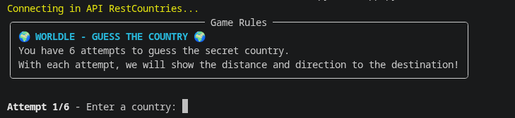
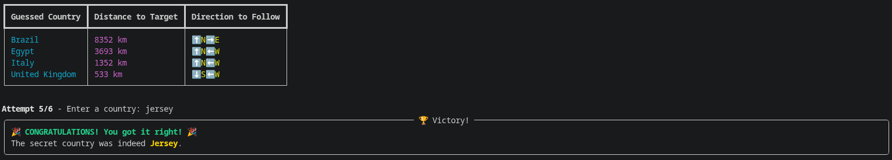

# Projeto de Aplicação Integrada a Serviço Web: Worldle

## 1. Introdução

O presente projeto consiste no desenvolvimento de um jogo singleplayer em Python utilizando a API `countriesnow.space`.

O desenvolvimento deste projeto foi realizado pelos alunos:

- Carolina Nunes de Carvalho
- Heitor Fernandes Paes Leme Campos

---

# 2. Worldle
## Contextualização

O Worldle é um jogo singleplayer online onde o usuário deve adivinhar qual é o país secreto do dia. Nele, a cada tentativa do usuário, o jogo mostra a distância e a direção em que o país secreto está em relação à tentativa. No jogo original, o jogador se baseia no formato do território para acertar o país da vez; No entanto, nessa adaptação, o jogo se aproxima mais do jogo diário original wordle ao estar "refém" de apenas os seus próprios _guesses_.

---

## Regras do jogo

O usuário deve tentar adivinhar qual é o país secreto em apenas 6 tentativas.

A cada tentativa, o usuário deverá dizer algum país (em inglês).

Caso o país não seja o correto, o programa irá disponibilizar a distância e a direção em que o país secreto se encontra em relação ao país escolhido pelo usuário.

Caso o usuário acerte em até 6 tentativas, o jogo acaba e o usuário ganha.

---

## Objetivo do Jogo

Acertar qual é o país secreto em até 6 tentativas.

<div align="center">

<figcaption> Tela inicial </figcaption>
</div>

---

<div align="center">

<figcaption> Exemplo de jogo </figcaption>
</div>

---

# 3. Integração Web

O jogo consome a API `https://countriesnow.space/`, onde ele recebe o nome e posição (latitude e longitude) de cada país no mundo e processa os dados obtidos. Além disso, o programa realiza cálculos de distância entre países utilizando a Fórmula de Haversine, fórmula matemática focada em determinar a distância entre dois pontos na superfície de uma esfera.

# 4. Como Executar a Aplicação

## Requisitos

- Python 3.11 ou superior

## Instalação de Dependências

```bash
pip install -r requirements.txt
```

## Execução

```bash
python3 app.py
```

Ao iniciar a aplicação, o jogo começará imediatamente.

